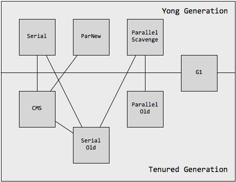

# 一、JVM内存管理

## 1. JVM内存区域

在java虚拟机规范中对JVM所管理的内存做了以下划分，每个JVM实现厂商和同JVM实现的各个版本之间的实现都各有不同。但是区域的划分还是以下这几块。

.jpg)

### 1.1程序计数器 

也叫pc寄存器，他主要负责记录当前线程所执行到的字节码的行号，由于java多线程采用的是CPU轮转法来实现的，因此同一时刻一个处理器只能处理一个线程的一条字节码指令，为了保存当前线程执行字节码的状态(执行到的行号)所以需要把当前执行到的字节码行号存储进程序计数器中来方便线程状态的恢复。因此这个区域是各线程私有的。它也是唯一 一个不会发生内存溢出的区域。

### 1.2虚拟机栈

虚拟机栈就是平时所说的`堆栈`中的`栈`,他也是线程私有的，主要用来存储栈帧，而栈帧则是java方法的模型，其中存储着局部变量表、返回地址等信息。虚拟机栈的生命周期与线程相同，线程在java方法的执行过程，就对应着栈帧的入栈与出栈的过程，因此它也是线程私有的区域，并且如果入栈的深度超过虚拟机规定的深度的话会抛出StackOverflowError，有些虚拟机是允许动态扩展栈的，如果扩展时没有分配到内存将会抛出`OutOfMemoryError`异常。

### 1.3本地方法栈

本地方法栈与虚拟机栈类似，只不过它是为Native方法服务的，在JVM规范中没有定义本地方法栈所使用的语言，所以Native方法可以使任何语言实现，他同样也会抛出`StackOverflowError`，`OutOfMemoryError`。

### 1.4堆

堆是JVM中内存区域最大的部分，用来存储对象的实例，几乎所有的对象实例都在堆中分配内存，这也是GC主要管理的区域，当堆中无法分配到内存并无法扩展时将会抛出`OutOfMemoryError`。它是线程共享的一个区域。

### 1.5方法区

与堆一样是线程共享的区域，主要存储被加载器加载过的类信息，静态变量、常量等信息。JVM规范定义方法区是堆的一个逻辑部分，因此可以让GC来管理着部分内存区域，来减少为这片区域在开发一套内存管理的代码，因此有些人也叫这部分区域为永久代，因为这部分内存被GC的几率比较少，但在JDK8以后已经把永久代放弃并把方法区的内容移动到本地内存中。

### 1.6运行时常量池

运行时常量池是方法区的一部分，Class文件不光有对类、接口、字段、方法的描述信息，还有常量池，用来存储在编译期间产生的字面量和符号引用信息。这部分内存将在类加载后放入方法区中的运行时常量池。运行时常量池也可以在运行时添加新的常量，比如String类的intern()。

### 1.7直接内存

直接内存不是JVM管理的内存区域，但是JVM会经常使用到它，可以理解为是计算机的RAM中JVM以外的内存区域，在JDK1.4中引入的NIO，采用的DirectByteBuffer对象就是使用的Native函数库在直接内存中开辟的空间，然后通过堆中DirectByteBuffer对象持有这个内存的引用来进行操作，因此在IO操作时提高性能，减少了JVM堆与直接内存之间数据的相互复制。

## 2.对象内存管理

### 2.1对象的创建

对java程序来讲创建对象就是通过new关键字来完成，但在jvm中遇到一条new指令，则先会到常量池中查找是否有对应的符号引用，并查看符号引用代表的类是否已经完成加载、初始化等，如果没有则执行类加载过程。

检测完类加载后，则给新的对象分配内存空间，分配的方式根据内存空间是否规整分为两种，

* 指针碰撞：当内存空间规整时则使用`指针碰撞`来分配，即内存空间分为两部分，一分部是空闲的一部分是已使用的，中间夹着一个指针，当分配内存时则把指针向空闲处移动让出足够对象使用的空间大小这种方式就叫做`指针碰撞`。
* 空闲列表：当内存空间不规整时，即在整个内存空间中已使用的内存和未使用的内存都夹杂在一起，这时想要找到空闲的的内存就需要使用一个列表类记录空闲内存的位置。这种方式叫做空闲列表。

而java堆是否规整则根据所采用的垃圾收集器是否带有压缩整理功能来决定。

对象创建时还有并发问题，当一个线程创建A对象时，此时指针还没来及矫正又有一个线程来创建B对象，此时使用的就是还未矫正的指针来开辟的内存空间，因此产生的并发安全问题，那么解决创建对像时的并发问题有两种解决方式：

* 使用CAS加失败重试的方式来保证原子性
* 把各个线程分配内存的动作划分在不同的空间内进行，即每个线程在堆中都提前分配一小块内存，称为本地线程分配缓存(Thread Local Allocation Buffer，TLAB)，只有TLAB用完分配新的TLAB的时候才会同步锁定，JVM可以使用-XX:+/-UseTLAB参数设置。

分配完空间后，JVM要对分配的空间做初始化值为零的操作，这一步也可以在分配TLAB时执行，这步操作可以让字段在不赋初始值就可以直接使用，程序可以访问到这些字段类型所对应的零值。

接下来对 对象做一些设置，配置对像头中的信息，比如hashcode，GC分代年龄，元数据等信息。

上面的工作完成之后，在JVM角度一个对象已经创建完成，但在程序的角度还没有执行构造函数，当构造函数执行完后才算真正的创建成功。

**总结**：

1. 如果new对象所属的类没有被加载，就会进入类加载过程。想加载父类后加载子类
2. 然后会在堆内存空间中为对象开辟内存空间
3. 为对象的成员属性赋初始值
4. 执行实例化代码块和构造函数，先执行父类后执行子类。
5. 把构造出来的对象赋值给虚拟机栈中的引用变量。

### 2.2对象的内存结构

总共分为三部分，对象头、实例数据、对齐填充。

* 对象头：在HotSpot中对像头分为两部分，一部分是运行时收据，如哈戏码，GC分代年龄，元数据，偏向线程ID，锁标志位，线程持有的锁。另一部分则是类型指针，即指向类元数据的指针，JVM根据此指针知道此对象属于哪个类的实例。如果对象是个数组则对象头还得有一块区域存储数组的长度，因为普通对象可以通过类元数据知道大小，但是数组不能。
* 实例数据：存储的对象的有效数据，就是定义的字段信息等。
* 对齐填充：它是没有任何含义的，只能用来为java对象的内存大小填充到8字节的倍数，因为HotSpot虚拟机的自动内存管理系统规定对象的大小必须是8字节的倍数。

### 2.3对象的访问

对象的访问方式大致有两种，句柄、直接引用，HotSpot采用的是第二种

* 句柄：在堆中有一个句柄池，引用存储的是对象的句柄地址，根据此地址到句柄池中寻找到句柄，而句柄中包含了对象实例的地址信息和类型数据的地址信息。
* 直接引用：引用存储的就直接是该对象实例地址，但是对象实例中要包含数类型数据地址。

## 3.内存溢出实战

### 3.1堆内存溢出

堆存储的是对象的实例，当我们创建大量的对象并让其被其他变量引用不被GC就会导致堆内存溢出。如下示例：

```java
/***
 * JVM Args:-XX:+HeapDumpOnOutOfMemoryError -Xms20m -Xmx20m
 */
public class Test {

	public static void main(String[] args) {
		List<StringBuffer> list = new ArrayList<>();
		while(true) {
			list.add(new StringBuffer());
		}
	}	
}
```

> Exception in thread "main" java.lang.OutOfMemoryError: Java heap space
> 	at java.util.Arrays.copyOf(Arrays.java:3210)
> 	at java.util.Arrays.copyOf(Arrays.java:3181)
> 	at java.util.ArrayList.grow(ArrayList.java:265)
> 	at java.util.ArrayList.ensureExplicitCapacity(ArrayList.java:239)
> 	at java.util.ArrayList.ensureCapacityInternal(ArrayList.java:231)
> 	at java.util.ArrayList.add(ArrayList.java:462)
> 	at com.zchg.Test.main(Test.java:34)

JVM参数-XX:+HeapDumpOnOutOfMemoryError配置堆内存溢出时导出快照文件，我们可以通过工具分析快照文件查看堆内存分配情况，来分析内存泄露与内存溢出问题。导出的快照文件在当前项目下。

JVM参数-Xms20m -Xmx20m 分别为最小堆内存与最大堆内存。

#### 3.1.1 使用Eclipse的MemoryAnalyzer分析工具：

第一步：进入工具打开快照文件

第二步：查看堆内存占用情况

.jpg)

.jpg)

从上面就可以看出哪里占用内存最多，然后判断占用内存最多的对象是有用的还是没用的，判断是不是内存泄露，如果是内存泄露再通过工具查看对象的引用链来判断因为什么没有被GC。

.jpg)

点击此处就可以分析可以对象的引用链。

### 3.2栈内存溢出

由于栈有可能出现的异常有两种，一个是栈深入不够，还有一个是内存溢出，但是内存溢出通常发生在内存不够分配的时候，能够抛出这种异常的只能发生在建立的线程过多给虚拟机栈分配的空间不够的情况，至于栈内存使用过多抛出的则还是StackOverflowError，所以在发生 java.lang.OutOfMemoryError时可以减少线程数量或者减少每个线程栈的内存来解决。

```java
/***
 * JVM Args:-Xss128k
 */
public class Test {
	
	public static void main(String[] args) {
		stackOut();
	}
	
	public static void stackOut() {
		stackOut();
	}
}
```

> Exception in thread "main" java.lang.StackOverflowError
> 	at com.zchg.Test.stackOut(Test.java:38)....

虚拟机参数：-Xss虚拟机栈大小

### 3.3方法区内存溢出

由于方法区在JDK1.8后从永久代实现改为了元空间，以下通过向常量池添加过大变量不会导致内存溢出，在以前是可以的。

```java
/***
 * JVM Args:-XX:PermSize10m -xx:MaxPermSize10m
 */
public class Test {
	
	public static void main(String[] args) {
		int i = 1;
		while(true) {
			String.valueOf(i++).intern();
		}
	}
}

```

下面是通过CGlib动态生成大量的类，在JDK1.8之前会把方法区溢满，但是JDK1.8之后方法区的实现改为元空间后也不会导致内存溢出了

```java
/***
 * JVM Args:-XX:PermSize10m -xx:MaxPermSize10m
 */
public class Test {
	
	public static void main(String[] args) {
		while(true) {
			Enhancer enhancer = new Enhancer();
			enhancer.setSuperclass(OOMObject.class);
			enhancer.setUseCache(false);
			enhancer.setCallback(new MethodInterceptor() {
				
				@Override
				public Object intercept(Object arg0, Method arg1, Object[] arg2, MethodProxy arg3) throws Throwable {
					
					return arg3.invoke(arg0, arg2);
				}
			});
			enhancer.create();
		}
	
	}
	
	static class OOMObject {
		
	}
}
```

上面两个实验证明了永久代在JDK8以后被废弃了，改为元空间(Metaspace)来实现方法区，还是上面的代码把JVM参数换成一下参数设置

```java
/***
 * JVM Args:-XX:MetaspaceSize=10m -XX:MaxMetaspaceSize=10m
 */
```

> Caused by: java.lang.OutOfMemoryError: Metaspace
> 	at java.lang.ClassLoader.defineClass1(Native Method)
> 	at java.lang.ClassLoader.defineClass(ClassLoader.java:763)
> 	... 11 more

元空间和永久代的最大区别就是，元空间使用的内存是本地内存而不是虚拟机内存。取消永久代也是为了融合JRockit VM。 

### 3.4本机直接内存溢出

NIO	中DirectByteBuffer中使用的是Unsafe类的allocateMemory()来分配的直接缓冲区，下面就通过反射获取Unsafe类并使用他的allocateMemory()来分配本机内存。

```java
import sun.misc.Unsafe; //这个包要手动导入，因为Unsafe类被设计为只有引导类加载器加载的类才能使用也就是						 //JDK下的源码能用
/***
 * JVM Args:-XX:MaxDirectMemorySize=10m
 */
public class Test {
	
	public static void main(String[] args) throws Exception {
		Field field = Unsafe.class.getDeclaredFields()[0];
		field.setAccessible(true);
		Unsafe unsafe = (Unsafe) field.get(null);
		while(true) {
			unsafe.allocateMemory(1024*1024);
		}
	}
	
}
```

> Exception in thread "main" java.lang.OutOfMemoryError
> 	at sun.misc.Unsafe.allocateMemory(Native Method)
> 	at com.zchg.Test.main(Test.java:41)

本机直接内存溢出的堆栈提示信息会很少，因此发生堆栈信息很少并没有特殊提示的java.lang.OutOfMemoryError时，或者项目中直接或简介用到NIO的话可以判断出是此内存区域造成的。

## 4.对象无效算法

### 4.1 引用计数法

一个对象如果被其他地方引用，就会把这个对象的引用计数器加一，如果对象的引用计数器值为0代表对象已经无效了，可以回收。这种算法思想简单，但是无法解决对象间相互引用的问题。例如对象A与对象B相互引用，他们的引用计数器都是1，但是此时这两对象都没有被其他地方引用到，实际上都是无效的对象，但是却无法判断出他们是可回收的。

### 4.2 可达性分析算法

通过一些GC Roots节点做根节点，根据他们的引用链向下访问，能够访问到的是可用的对象，无法被任何GC Roots访问到的对象就是可回收的。在java语言中能作为GC Roots的对象又以下四种：

* 方法区中类静态属性引用的对象
* 方法区中常量引用的对象
* 虚拟机栈中(栈帧中本地变量表)引用的对象
* 本地方法栈中(Native方法)引用的对象

### 4.3 引用分级

在JDK1.2之前java中的引用概念很单一，只是代表着指向一块内存空间的头，作为对象来说只有被引用和未引用两种状态，为了能让对象的引用有更多的状态，在JDK1.2之后对引用分为了四类，能够让其表示出更多对象被引用的状态，例如要表示一个不太重要的对象，当内存空间足够是保留它，不够是回收他。

* 强引用：就是平时所理解的那种引用，被强引用的对象永远不会被回收。
* 软引用：用来表示一种有用不是必须需要的对象，当要发生内存溢出时就会把软引用关联的对象列入可回收的那一部分中，提供了SoftReference实现软引用。
* 弱引用：用来表示一种非必须对象，他只能存活到下一次垃圾收集的时刻之前，WeakReference实现弱引用
* 虚引用：它是最弱的一种引用关系，一个对象是否有虚引用存在完全不影响他的生存时间，也无法通过虚引用获得任何对象实例，他存在的意义就是这个对象被垃圾收集时会收到一个系统通知。PhantomReference实现虚引用。

### 4.4 对象回收过程

当对象没有被引用后并不会立即被回收，而是对其进行第一次标记并对其进行判断，判断finalize()是否有必要执行，如果finalize()未被覆盖或已执行过则认为没有必要执行。

如果被判定为有必要执行 则会将其加入到F-Queue中，然后创建一个第优先级的finalizer线程执行它，但是不能保证这个方法一定执行完，随后JVM会对F-Queue中的对象进行小规模的标记，如果第二次被标记时逃脱则会从被回收集合中移除，如果没逃脱掉则真的被回收了。finalize()能做的事finally块都可能更好的完成，只所以有它java早起为了C++程序员能够快速的接受java而做出的牺牲。

下面是finalize()逃脱的例子

```java
//这个例子说明了finalize()只会被系统调用一次
public class Test {
	static Testfinalize tf = null;

	public static void main(String[] args) throws Exception {
		tf = new Testfinalize();
		tf = null;
		System.gc();
		Thread.sleep(500);
		if(tf!=null) {
			tf.isAlive();
		}else {
			System.out.println("is dead");
		}
		
		tf = null;
		System.gc();
		Thread.sleep(500);
		if(tf!=null) {
			tf.isAlive();
		}else {
			System.out.println("is dead");
		}
	}
	
}

class Testfinalize{
	
	@Override
	protected void finalize() throws Throwable {
		super.finalize();
		System.out.println("finalize被执行！");
		Test.tf = this;
	}
	
	public void isAlive() {
		System.out.println("还存活着");
	}
	
}
```

> finalize被执行！
> 还存活着
> is dead

### 4.5 方法区的垃圾回收

方法区主要回收的对象有两个，一个是常量池中的常量和不用的类，回收常量跟堆中回收实例类似，就是没有被引用时将被回收，回收不用的类条件则苛刻一些如下：

* 这个类没有任何的实例存活
* 加载这个类的ClassLoader已被回收
* 该类对应的java.lang.Class对象没有被任何地方引用，无法在任何地方通过反射访问这个类的方法

满足以上三个条件的类就可以被回收，具体受-Xnoclassgc参数控制，在经常使用CGlib，动态代理等技术时需要有这样的类卸载功能来防止方法区的溢出。

## 5. 垃圾回收算法

### 5.1 标记-清除算法

对需要回收的对象打上标记，然后对标记的对象进行清除，这个算法有两个问题，第一个是效率不高标记和清除这两步效率都不高，第二个是会产生大量的空间碎片不连续的内存，在需要分配大片连续内存时容易提前产生GC。

### 5.2 复制算法

现在大多数虚拟机都是用此算法回收新生代，它把新生代分为了三块，其中一大块分给了Eden，其他两块分为了两个survivor，每次使用Eden与一块survior，当回收时会把这两块中存活的对象移动到领一块survior中，默认比例为8:1:1，如果存活的对象大于10%时，也就是一款survior放不下时就会去老年代进行分配担保。

### 5.3 标记-整理算法

标记还是一样的，整理是让存活的对象都移动到边界处，然后清除边界以外的内存。

### 5.4 分代收集算法

他没有什么新的思想，而是对堆内存进行的划分，根据对象存活的声明周期不用划分为了新生代和老年代，然后根据各自的特定选择更适合的垃圾收集算法来进行服务，一般新生代存活率较低复制操作比较少适合使用复制算法，而老年代存活率比较高又没有新的空间做担保，所以一般使用`标记-清除`或者`标记-整理`算法。

##6 垃圾收集器



如上图所示主要垃圾收集器有七种(JDK1.8)，更具各自的特性分别应用于年轻代与老年代。

### 6.1 Serial收集器

他是最早的一个收集器，它是一个单线程收集器，而且在GC时还会STW(Stop the World)，STW的发生会影响到程序的响应速度，所以一直以来人们都在向STW时间减少上发展，在JVM Client模式下年轻代的垃圾收集使用的还是Serial，因为他简单，垃圾收集时单纯，而且在Client模式下可管理的内存也少，这点STW时间还是能够接受的。

### 6.2 ParNew收集器

他是Serial的多线程版本，除此之外跟Serial一样，并且只有他能够与CMS一起搭配使用，他用于Server模式下新生代区域，在JDK8之前Serial也能搭配CMS 但是使用率比较低所以为了减少维护JVM成本就把这种组合给移除了。

### 6.3 Parallel Scavenge收集器

他是一个新生代收集器，看起来与ParNew一样，但是他与ParNew不同的地方在于，ParNew是关注GC停顿时间的，而Parallel Scavenge关注的是吞吐量。所谓吞吐量说的是cpu总运行时间与用户线程使用cpu时间的一个比例例如垃圾收集线程占用cpu一分钟，jvm总共占用cpu100分钟那吞吐量就是99%。

用户线程的低停顿适合用户客户端与用户交互的场景，而吞吐量高证明cpu利用率更高，能够能快的完成任务适合完成后台任务。Parallel Scavenge提供了两个参数，-XX:MaxGcPauseMillis设置最大垃圾收集停顿时间，-XX：GCTimeRatio设置吞吐量，吞吐量的设置为19代表GC占用时间为5%(1/(1+19)).与ParNew还有一个区别就是可以设置自适应调节-XX：+UseAdaptiveSizePolicy。

### 6.4 Serial Old收集器

是Serial老年代版本，他主要意义是用在Client模式下，如果用在Server模式下主要用来作为CMS失败后的预备方案来用和与Parallel Scavenge配合使用。在JDK1.8中已经移除了Serial Old与ParNew的搭配。使用的`标记-整理`

### 6.5 Parallel Old收集器

 它是Parallel Scavenge老年代版本，使用`标记-整理`算法，他的出现主要是为了配合Paralle Scavenge使用的，因为在他出现之前老年代只有Serial Old能与它配置所以导致性能没有体现出来，直到这个收集器出现后才真正发挥出了它的效果。在JDK1.8中默认使用的就是Parallel Scavenge与Parallel Old组合，因为这个组合都是注重CPU使用率的非常适合服务端使用。

### 6.6 CMS收集器

CMS(Concurrent Mark Sweep)收集器是一个以获取最短停顿时间为目的的收机器，非常适用于追求响应速度的场景，他采用`标记-清除`算法，他的垃圾收集主要分为以下四步：

* 初始标记
* 并发标记(与用户进行并发进行)
* 重新标记
* 并发清除(与用户进行并发进行)

初始标记只是标记一下GC Roots能直接关联的对象所以非常快，并发标记就是去查找不可用的对象，而重新标记就是为了修正并发标记过程中用户进程运行后导致的标记改变，由于整个过程初始标记与重新标记所占时间很少，所以可以说CMS时一个可以与用户线程并行的收集器。它有三个明显缺点：

* CMS对CPU资源占用有很大影响，因为垃圾收集线程与用户线程一起执行，所以会抢占一部分线程资源。
* CMS无法处理浮动垃圾，浮动垃圾就是在并发清除时用户进行又产生的垃圾，此时这些垃圾是无法得到处理的只能等到下一次GC是清理，所以在并发清理时还需要预留一部分内存空间为用户线程使用，用来存储这些浮动垃圾，如果预留空间不足时将会产生“Concurrent Mode Failure”，这个预留空间的大小可以用参数配置，如果发生了“Concurrent Mode Failure”就会采用预备的Serail Old 来对老年代区域进行垃圾处理，此时就会产生用户线程停顿。
* CMS采用“标记-清除”算法容易产生空间碎片，提前出发GC，为了解决这个问题CMS提供了一个开关参数-XX:+UseCMSCompactAtFullCollection开关参数，用于在CMS快GC时进行碎片整理，如果内存碎片整理必须停止工作线程，所以CMS有提供了另外一个参数来进行间隔性执行整理压缩功能-XX:CMSFullGCsBeforeComaction，这个参数表示多少次Full GC后进行一次压缩整理，默认参数为0。

### 6.7 G1收集器

G1收集器可以自己管理整个堆内存不需要与其他收集器配合使用，主要有以下特点：

* 与用户进程并发执行
* 分代收集：虽然他可以管理整个堆内存，但是他依然有分代的概念，对新创建的对象和存活一段时间的对象有不同的收集策略。
* 空间整合：和CMS相比，他采用的是“标记-整理”与"复制算法"不会产生内存碎片
* 可预测停顿：这也是比CMS要强的地方，他可以让用户控制在一段时间内可以有多少时间用于在垃圾收集上

G1能够在指定的时间内来完成垃圾收集，主要因为他会对垃圾区域进行优先级筛选，优先清理优先级高的内存区域，这样就能在最短的时间内达到最大的垃圾收集效率，他的主要收集步骤：

* 初始标记
* 并发标记
* 最终标记
* 筛选回收

其中前三步与CMS一样，第四步则会停止用户线程进行排序根据优先级收集垃圾，因为这一步可用时间是用户指定的所以可以控制在可接受的范围内专门做垃圾回收工作。

## 7 GC日志

-Xloggc:./gc.log 指定GC日志存储位置 

-XX:+PrintGCDetails 打印日志详细信息 

-XX:+PrintGCDateStamps 打印时间

.jpg)

GC日志大致分为三部分，第一部分是虚拟机版本型号与启动参数，第二部分是GC操作记录，第三部分是堆内存情况。

## 8 jvm工具

### 8.1 jps

查看虚拟机进程状态的，能看到进程号(VMID)

### 8.2 jstat

虚拟机信息监控工具，能查看GC用的时间，堆内存使用情况，类加载时间数量等信息

### 8.3 jinfo

查看虚拟机的配置信息，能查看启动参数等

### 8.4 jmap

用来生成堆转储文件

### 8.5 jhat

堆转储文件的分析工具(命令行分析)

### 8.6 jstack

堆栈跟踪工具，查看线程堆栈信息。

### 8.7 Jconsole

上面的都是命令行工具，JDK还带了两个可视化监控工具，Jconsole监控CPU、线程、堆内存、类信息等情况

### 8.8 jvisualvm

比Jconsole要强大的一个工具，可以安装很多插件。

## 9. JVM调优

调整JVM内存大小，调整并发收集器的线程数量，调换垃圾收集器，每次调整后来查看运行后的GC次数和GC时间是否有改善，并记录每次调整参数及JVM运行状态信息。

# 二、jvm执行子系统

## 1.Class文件结构

Class文件结构中只有两种数据类型，无符号数：U2(2字节) U4(4字节) U8(8字节) 代表基本数据类型，表：用来代表复合数据类型一般以_info结尾命名。下表是Class的文件结构

| 类型           | 名称             | 描述                                                   |
| -------------- | ---------------- | ------------------------------------------------------ |
| u4             | 魔数             | 代表着这个文件的类型                                   |
| u2             | 次版本号         |                                                        |
| u2             | 主版本号         | 代表当前JDK版本，JDK版本号从45开始(十进制)             |
| u2             | 常量池计数器     | 统计常量池中的数量                                     |
| cp_info        | 常量池           | 里面全都是一个个常量                                   |
| u2             | 访问标志         | 存储访问标识符的地方(private public等)                 |
| u2             | this对象         |                                                        |
| u2             | super对象        |                                                        |
| u2             | 接口表集合计数器 | 统计实现的接口数量                                     |
| u2             | 接口表集合       | 接口存放的地方                                         |
| u2             | 字段表集合计数器 | 统计字段的数量                                         |
| field_info     | 字段表集合       | 字段存放的地方                                         |
| u2             | 方法表集合计数器 | 统计方法的数量                                         |
| method_info    | 方法表集合       | 方法存放的地方                                         |
| u2             | 属性表集合计数器 | 统计数量                                               |
| attribute_info | 属性表集合       | 存储属性(比如方法中的代码段就放在这里的其中一个属性中) |

.jpg)

class文件是以8字节为一个单位的二进制文件，如图是16进制表示的样子两个16进制代表一个字节，其中u4(前四字节)是Class文件魔术CAFEBABE，后四个字节代表次版本号和主版本号(可以看出是JDK8)，再后两位是常量池计数器(可以看到有多少常量)，再后面是常量池中第一个常量(其中u1代表常量类型为7表示是class_info型常量)后u2是指向其他常量的引用这里是2带表常量池中第二个常量就是这个class_info的名字。

## 2.字节码指令

字节码指令就是由一个字节存储的带表特殊操作含义数字，可以通过javap查看到每一个java代码对应的指令

## 3.类加载过程

.jpg)

类的生命周期总共有七个阶段其中从加载到初始化之间的过程就是类的加载过程。

1. 加载阶段：虚拟机规范里规定根据“通过一个类描述的全限定名找到指定文件以二进制流的方式加载进来”，因此加载一个类我们可以通过类加载器从任何地方加载。加JVM参数-verbose:class打印类加载卸载日志
2. 链接阶段：用来将class文件整合到jvm中让其可以执行

   （1）验证：校验加载的class文件是否符合jvm规范，是否会对jvm造成危害，比如魔术是否是CAFEBABE，版本     号是否在JVM能处理的范围等。

  （2）准备：为类的静态属性进行分配内存空间，并初始化值为0或者null

  （3）解析：由于class文件在没有被加载到jvm之前并不知道其他类的属性和方法的内存地址，所以只能用符号引用来代替，我们需要把符号引用解析为具体的内存地址才能让这个类正常使用，如果在解析过程当中其他的类没有解析则会加载相关的类

3. 初始化：对类的静态属性赋值语句和静态代码块置于<clint>方法中对其进行执行。在此期间<clinit>()方法的执行时加锁同步的，所以才有了用类加载实现线程安全的单例模式。

**类加载触发条件**

1. 调用类的静态方法时，如果类没被加载则进入类加载过程
2. 调用类的静态属性时，如果类没被加载则进入类加载过程
3. new一个对象时，如果类没有被加载则进入类加载过程
4. 子类被加载时，父类也会进入加载过程
5. 通过反射API操作一个类时，也会让这个类进入类加载过程

## 4.类加载器

.jpg)

JDK自带的类加载器有以上这三个，分别加载lib下的rt.jar包，lib下的ext文件夹下的jar，classpath下的jar，类加载器能够加载不同位置上的class分工明确，并且不同类加载器加载进来的类是永远不想等的，也就是说就是同一个类文件经过不同的类加载器加载进程序做比较的话也是不想等的。应用程序类加载器通过加载系统参数配置来获取要加载的类路径`System.getProperty("java.class.path")`，IDE开发工具都为我们自动配置好了这个参数所以他才会知道我们写的类文件在哪里，我们可以使用`Test.class.getClassLoader()`获取加载这个类的类加载器。

## 5.双亲委派模型

这个模型用来描述类加载器之间的关系是子类依赖父类的，也就是子类加载器要加载一个类的话会先让父类加载器去加载，如果父类加载不到再有子类加载器加载，这样做的好处时让java核心的API能够稳定执行，因为rt.jar中的核心类最终都会由核心类加载器加载，也就是在整个应用中这个包中的所有类·就这一个版本不会有重复的。大家使用的Object类都还一个版本的。

自己实现类加载器只需要继承ClassLoad类并实现findClass(),在其中使用defindClass()来加载类就可以，使用时如果想要用双亲委派模型就是用loadClass()，他里面实现的就是双亲委派的代码。

双亲委派典型的应用就还在Tomcat中，web容器需要实现很多自己的类加载器用来加载不同路径下的类文件。其中如果有想公用的类就用父类加载器加载，自己这个项目私有的类就用这个项目专有的类加载器加载。

判断一个类的唯一性：被同一类加载器加载，类名相同。也就是说不同类加载器加载的类会认为不是同一个类，并且同一个类加载器不会重复加载class文件，所以class文件改变后只使用同一个类加载器是加载不到改变后的内容，热部署的实现就是通过检测文件发生改变后每次都创建一个新的类加载器去加载类。

## 6.方法掉调用(分派)

静态分派：

方法重载就属于静态分派，静态分派发生在编译期间，在编辑器编辑的时候就确定了要调用哪一个重载的方法，根据静态类型去匹配的重载方法，Father a = new Son() Fath就属于静态类型。

动态分派：

方法重写的调用就属于动态分派，发生在运行期间，是根据真实类型匹配的，因为对象的真实类型是运行期间才知道的，Father a = new Son()  Son就是真实类型。

# 三、程序编辑与代码优化

## 1.早期(编译期)优化

JVM并没有对编译期间做过多的优化，而是在运行时的JIT编译器上做了很多优化，因为编译器直接跟语言交互，如果对编译器做优化那么其他编程语言编译出来的Class文件将无法得到这些优化，那么java中对编译期做的最多的事就是对语法糖的解析，java中有很多的语法糖，如自动拆箱装箱、String、forEach、泛型等。语法糖本身并没有改变程序的功能，但是确提高了代码编写的效率与稳定性。其实在编译器编译java代码时会把语法糖解析成普通的java代码来执行。

## 2.晚期(运行期)优化

**JIT（即时编译器）**：jvm会把经常解释执行的代码标记为热点代码，并把热点代码由JIT直接编译成机器代码来提高程序运行效率。JIT有两种编译器实现，分别是C1与C2

C1：默认再client模式下使用，它编译用时短但编译出的机器码质量不高，适合用于客户端应用可以快速启动应用

C2：默认再server模式下使用，它编译用时比较长但编译出来的机器码质量高，适合服务端使用。

**分层编译**：对即使编译做了分层处理，一开始先使用C1编译器进行编译然后再慢慢过度到C2编译器做深度编译，这样既能够保证编译出的机器码质量又能提高服务的启动速度。JVM参数XX:+TieredCompilation

**关于JIT的线上问题场景**：在tomcat中部署服务的时候，启动tomcat时服务启动总是特别慢，起个服务需要花费10多分钟才能启动完，在这期间CPU使用率爆满，后来通过top -Hp PID指令查看是那个JVM线程占用这么高的CPU时发现是JIT的C2编译器线程再占用，最后的解决方案就是使用分层编译，JVM参数JAVA_OPTS="-XX:+TieredCompilation",在tomcat catalina.sh中的第一行配置这个

方法内联：如果一个方法中调用了另一个方法，JVM会把方法调用优化为代码复制内联到调用方法中。

逃逸分析：分析对象的动态作用域，如果发现这个对象不会被其他方法或线程访问到则证明这个对象不会逃逸，就可以做一些更高级的优化、如锁消除、或者把这个对象分配在栈中而不是堆中来减轻垃圾回收的压力，因为对象不被其他线程所共有也就没必要存放在堆中。

# 四、JVM线上问题定位

## 1. 正式环境的部署配置

### 1.1 内存

Xms Xmx 为物理机内存的一半，例如：服务器内存8G，JVM内存配置为4G

### 1.2 垃圾收集器

前台应用：CMS+parNew 使用响应优先的组合

后台应用：使用默认垃圾收集器

### 1.3 配置收集信息的JVM参数

-server 指定server模式运行，-verbose:gc -XX:+PrintGCDetails -Xloggc:filepath 打印GC日志信息，

-XX:+HeapDumpOnOutOfMemoryError 当OOM时导出内存快照

## 2. 监控方案

在JVM集群部署的时候要收集日志信息的方案，常用的两种，大众点评的**CAT**，或者**zabbix**监控系统

## 3. 频繁FULL GC

### 3.1 System.gc()

如果再程序中调用了System.gc()会有可能频繁出发Full GC，有一些第三方依赖中类库中也会使用System.gc(),例如**JXL**工具包在读取excel后调用close()时会调用System.gc()，如果我们发现GC日志中有频繁的System.gc()触发的Full GC时可以对代码进行排序时候有调用System.gc()的情况，我们可以更改代码，也可以直接使用JVM参数`-XX:DisableExplicitGC`直接禁用对System.gc()的支持

## 4.内存溢出

1. 保留现场，jmap -dump:format=b,file=filename.hprof -F PID, 导出内存快照到文件，-F强制执行，内存不够用时可能不会立即执行jmap需要使用-F强制执行
2. 立即重启服务恢复正常使用
3. 把快照文件导入到离线环境使用MAT(Eclipse Memory Analyze)分析快照文件，他会自动生成一个报表描述出可疑点，也可以使用此工具看到那些对象占用的空间最多等信息。

## 5.接口响应慢

如果发现线上接口响应慢，想要排查问题思路如下：

1. 先看线上的服务器的CPU使用率和内存是否爆满
2. 使用jstack工具查看线程方法调用栈，观察下那些自己写的代码被线程调用的比较多，出现这种情况很有可能是这里的代码有问题导致很多线程执行时都卡在了这里
3. 然后去分析具体的代码看是否有问题，如果这段代码有调用数据库或者其他网络接口则可以看下是否调用这些接口慢了。
4. 同时jstack可以分析出是否死锁，直接可以在jstack打印信息的最下方查看死锁信息。
5. 还可以使用jstack分析是否有线程长时间阻塞，可以隔一段时间再执行下jstack来查看下两次jstack的信息中是否有同一个线程阻塞的信息。

## 6.CPU占用率高

1. 线上服务器中查看占用CPU最多的线程，top -p javapid -H 查看java进程中的线程占用资源信息，然后按R来排序，找到对应线程的ID，然后把十进制的ID转换为十六进制
2. 使用jstack查看线程信息，使用找到的十六进制的线程ID寻找对应的线程代码调用堆栈信息，来查看对应的代码逻辑解决问题。

# 附录

一、元空间文章https://www.cnblogs.com/yulei126/p/6777323.html


